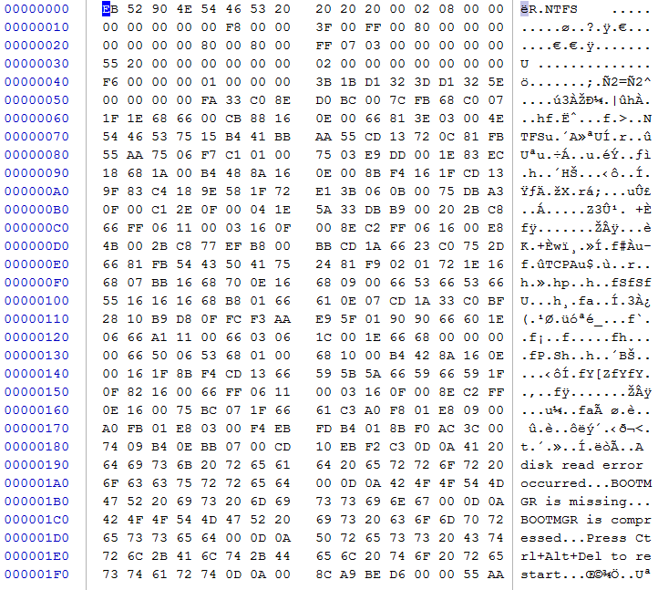
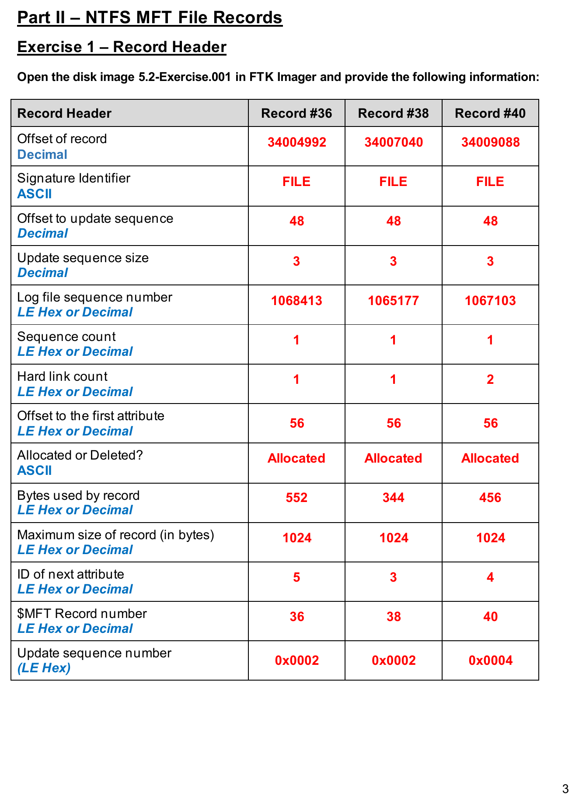
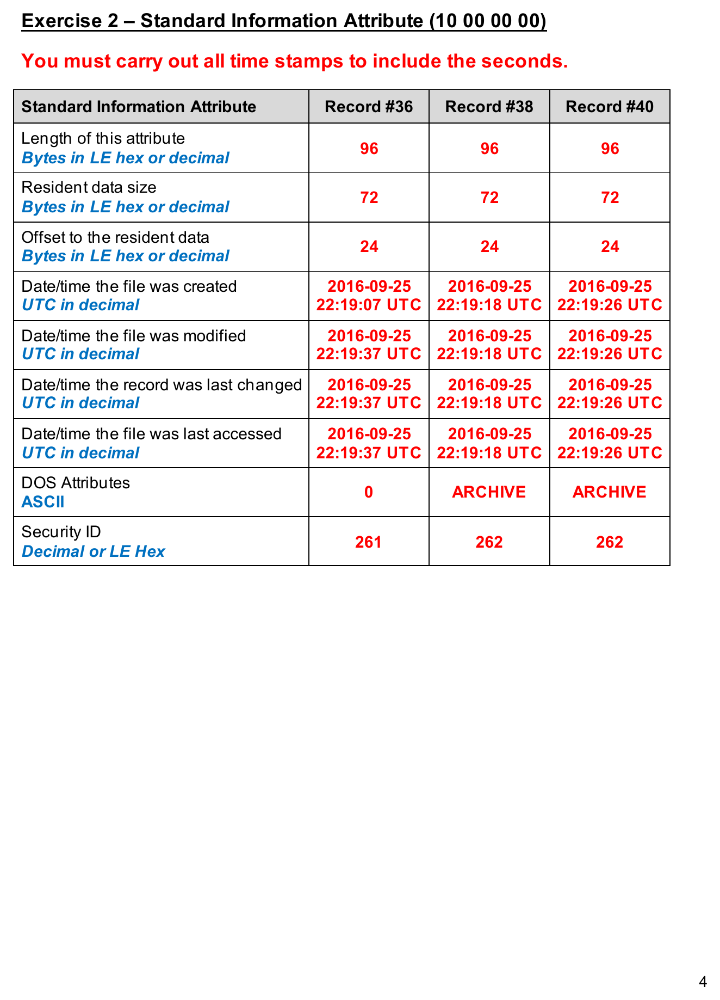
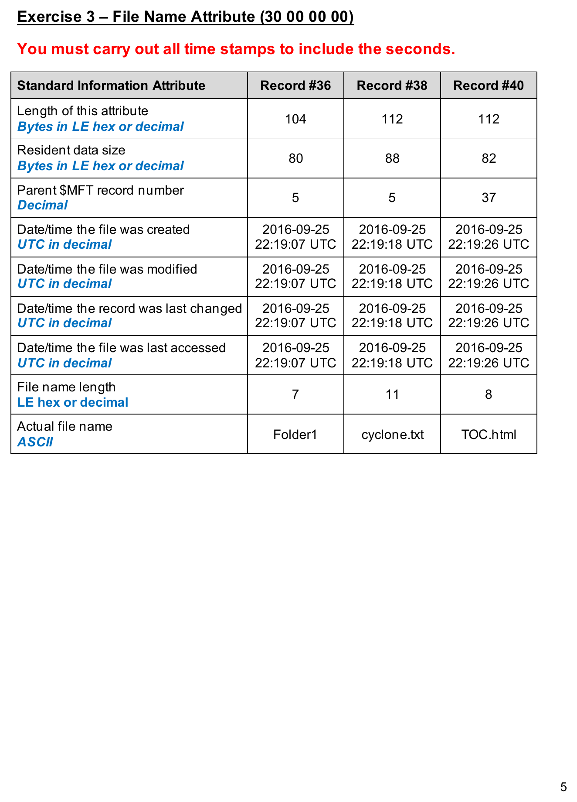
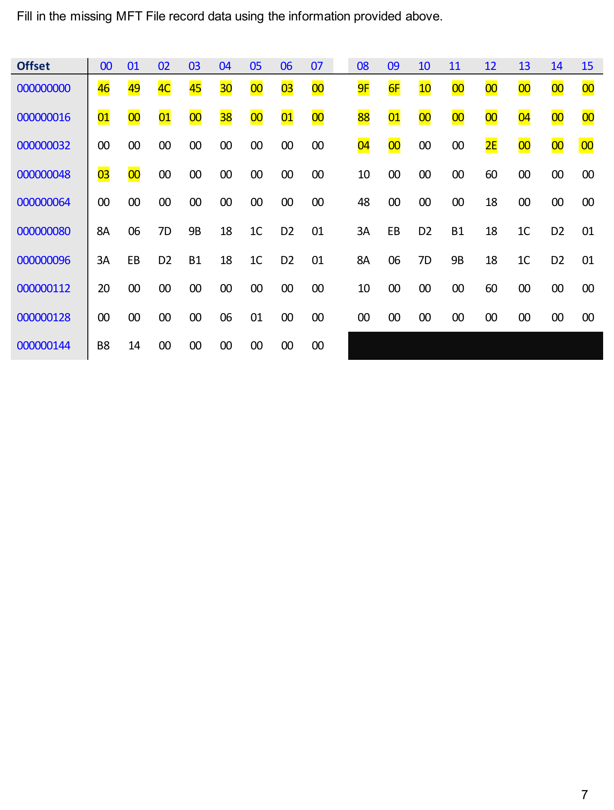

# Cross-Platform Disk Image Analysis Lab

A digital forensics portfolio project based on coursework analyzing **NTFS** and **Mac HFS/HFSX** forensic images with **FTK Imager** and hex-level file-system interpretation.

## Coursework Focus

This project combines two areas of digital forensics coursework:

- NTFS boot-sector and Master File Table (MFT) analysis
- Mac OS X Tiger HFS/HFSX image examination with FTK Imager

The goal is to demonstrate the ability to identify and interpret low-level file-system structures across different operating systems.

## Skills Demonstrated

- FTK Imager
- NTFS boot-sector analysis
- NTFS Master File Table analysis
- Standard Information and File Name attributes
- HFS/HFSX image examination
- Hexadecimal interpretation
- Little-endian values
- Sector and cluster calculations
- File-system metadata analysis
- Cross-platform forensic examination
- Technical documentation

## NTFS Coursework Evidence

The NTFS portion of this repository is based on a graded digital-forensics lab using the `5.1-Exercise.001` and `5.2-Exercise.001` disk images in FTK Imager.

### Boot Sector Analysis

The coursework required identifying and decoding:

- OEM ID
- Bytes per sector
- Sectors per cluster
- Bytes per cluster
- Total sectors
- `$MFT` starting cluster
- `$MFTMIRR` starting cluster
- Volume serial number
- Backup boot record sector
- `55 AA` VBR footer signature

For the `5.1-Exercise.001` image, the completed analysis recorded:

- OEM ID: **NTFS**
- Bytes per sector: **512**
- Sectors per cluster: **4**
- Bytes per cluster: **2048**
- Total sectors: **96,255**
- `$MFT` starting cluster: **8,021**
- `$MFTMIRR` starting cluster: **4**
- Volume serial number: **6F231D3A3D1D3A0E**
- VBR footer signature: **55AA**

### MFT Record Analysis

The `5.2-Exercise.001` portion examined MFT records **#36, #38, and #40**. The lab included:

- Record offsets and `FILE` signatures
- Update-sequence offsets and sizes
- Log file sequence numbers
- Hard-link counts
- First-attribute offsets
- Record allocation status
- Bytes used and maximum record sizes
- `$MFT` record numbers
- Update-sequence numbers

The lab also decoded the **Standard Information Attribute (`10 00 00 00`)** and **File Name Attribute (`30 00 00 00`)**, including timestamps, DOS attributes, security IDs, parent MFT record numbers, and file names.

Example file names identified in the records included:

- `Folder1`
- `cyclone.txt`
- `TOC.html`

### MFT Hex Reconstruction

A final exercise used provided metadata for MFT record **#46** to reconstruct missing byte values in a hexadecimal file-record table. This demonstrated how logical MFT metadata maps back to raw record bytes.

## Coursework Images

The images below are taken directly from the graded assignment and should be uploaded at full PNG quality.

### NTFS Boot Sector



### MFT Record Header



### Standard Information Attribute



### File Name Attribute



### MFT Record Hex Reconstruction



## Mac HFS/HFSX Coursework

A separate Mac OS X Tiger forensic-image lab involved FTK Imager examination of HFS/HFSX structures. That work included identifying:

- Volume name
- HFS+/HFSX file-system type
- Block / cluster size
- Sector size
- Sector count
- Cluster count
- Primary user
- Documents folder contents
- Desktop folder contents

The Mac/HFS section is kept separate from the NTFS evidence above so screenshots and findings are not mixed between different lab exercises.

## Repository Structure

```text
Cross-Platform-Disk-Image-Analysis-Lab/
├── README.md
├── images/
│   ├── README.md
│   ├── ntfs-boot-sector-analysis.png
│   ├── ntfs-mft-record-header.png
│   ├── ntfs-standard-information-attribute.png
│   ├── ntfs-file-name-attribute.png
│   └── ntfs-mft-record-hex.png
├── analysis/
│   ├── ntfs-boot-sector.md
│   ├── hfs-image-analysis.md
│   ├── endianness-and-offsets.md
│   └── comparative-findings.md
├── docs/
│   ├── examination-workflow.md
│   └── resume-project-entry.md
├── scripts/
│   └── little_endian_decoder.py
└── sample-data/
    └── example_hex_values.csv
```

## Important Note

This repository documents methods and concepts from coursework. It does not redistribute the original course forensic disk images.
